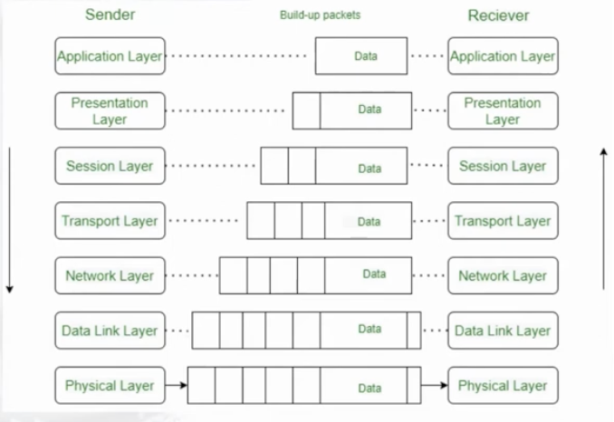
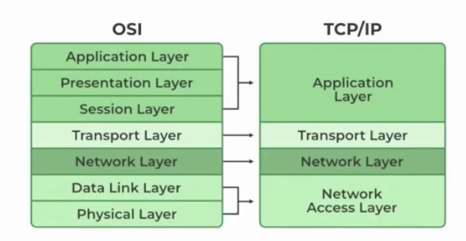

# 🏛️ Network Architecture Models

Network architecture models provide a standardized framework for understanding how devices communicate over a network. They divide network communication into multiple layers, where each layer performs a specific function.

The two most important networking models are:

- 🏛️ Open Systems Interconnection (OSI) Model
- 🌐 TCP/IP (Transmission Control Protocol / Internet Protocol) Model

---

# 🏛️ Open Systems Interconnection (OSI) Model

The **OSI Model** was developed by the **International Organization for Standardization (ISO)** as a conceptual framework for network communication.

It consists of **7 layers**, where each layer has a specific responsibility.

Although modern networks primarily use the TCP/IP model, the OSI model is still widely used for learning, troubleshooting, and understanding how network communication works.

---

## OSI Layers

| Layer | Name | Main Function | PDU (Unit of Data) |
|--------|------|---------------|--------------------|
| 7 | Application | Provides network services to applications | Data |
| 6 | Presentation | Data formatting, encryption, compression | Data |
| 5 | Session | Establishes, manages, and terminates sessions | Data |
| 4 | Transport | Reliable delivery, segmentation, flow control | Segment (TCP) / Datagram (UDP) |
| 3 | Network | Logical addressing and routing | Packet |
| 2 | Data Link | Physical addressing (MAC), framing, error detection | Frame |
| 1 | Physical | Transmission of raw bits over the medium | Bits |

---

## OSI Encapsulation

When sending data:

<p align="center">
  
</p>

When receiving data, the process is reversed (**Decapsulation**).

---

## Advantages

- Easy to understand
- Excellent troubleshooting model
- Clearly separates networking functions
- Vendor-independent

---

## Disadvantages

- Rarely implemented exactly as defined
- More complex than the TCP/IP model
- Some layers overlap in functionality

---

# 🌐 TCP/IP Model

The **TCP/IP Model** is the networking model used by the Internet and modern computer networks.

Unlike the OSI model, it is based on real-world protocols and practical implementation.

It consists of **4 layers**.

---

## TCP/IP Layers

| Layer | Main Function | PDU |
|--------|---------------|-----|
| Application | Provides services to user applications | Data |
| Transport | End-to-end communication | Segment (TCP) / Datagram (UDP) |
| Internet | Logical addressing and routing | Packet |
| Network Access | Physical transmission and framing | Frame / Bits |

---

## TCP/IP Encapsulation

<p align="center">
  
</p>

---

## Advantages

- Used by the Internet
- Simple and efficient
- Highly scalable
- Supports modern networking protocols
- Widely implemented by networking vendors

---

## Disadvantages

- Less detailed than the OSI model
- Some functions are combined into fewer layers

<p align="center">
  
</p>


---

# 📊 OSI vs TCP/IP Comparison

| OSI Model | TCP/IP Model |
|------------|--------------|
| 7 Layers | 4 Layers |
| Conceptual model | Practical implementation |
| Developed by ISO | Developed by DARPA |
| Mainly used for learning and troubleshooting | Used in real-world networks |
| More detailed | Simpler and more efficient |

---

## Layer Mapping

| OSI Model | TCP/IP Model |
|------------|--------------|
| Application | Application |
| Presentation | Application |
| Session | Application |
| Transport | Transport |
| Network | Internet |
| Data Link | Network Access |
| Physical | Network Access |

---

# 📦 Protocol Data Units (PDU)

As data moves through the network stack, its name changes depending on the layer.

| Layer | PDU |
|--------|-----|
| Application | Data |
| Presentation | Data |
| Session | Data |
| Transport | Segment (TCP) / Datagram (UDP) |
| Network | Packet |
| Data Link | Frame |
| Physical | Bits |

---

# 💡 Memory Tip

Remember the OSI layers from top to bottom:

```text
Application
Presentation
Session
Transport
Network
Data Link
Physical
```

Mnemonic:

> **All People Seem To Need Data Processing**

Or from bottom to top:

```text
Physical
Data Link
Network
Transport
Session
Presentation
Application
```

Mnemonic:

> **Please Do Not Throw Sausage Pizza Away**

---

# 📌 Key Takeaways

- The **OSI Model** is a conceptual model with **7 layers**, mainly used for learning and troubleshooting.
- The **TCP/IP Model** is the practical model used by the Internet and modern networks.
- Data is **encapsulated** as it moves down the layers and **decapsulated** as it moves up.
- The PDU changes as data travels through the layers:
  - **Data(message) → Segment → Packet → Frame → Bits**