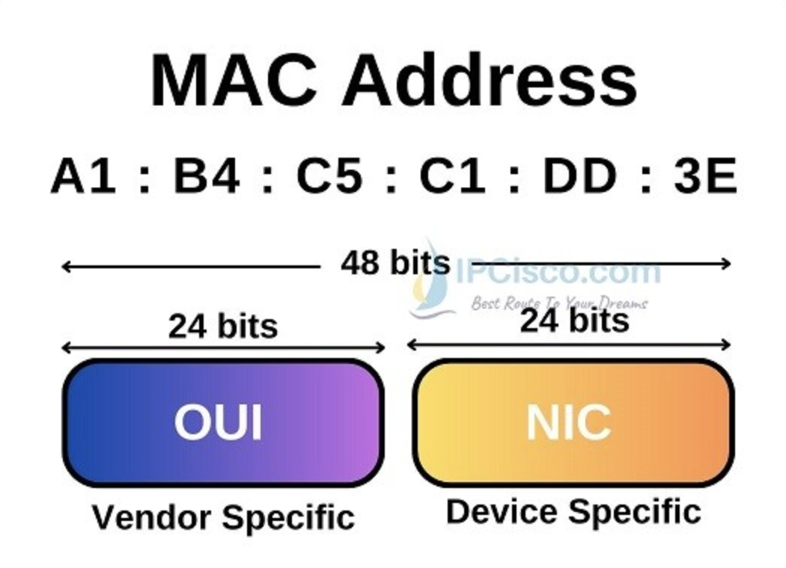

# 🏷️ Media Access Control (MAC) Address

A **Media Access Control (MAC) Address** is a unique hardware identifier assigned to a network interface card (NIC). It is used at the **Data Link Layer (Layer 2)** of the OSI model to identify devices within a Local Area Network (LAN).

Unlike an IP address, which can change depending on the network, a MAC address is typically **permanently assigned by the manufacturer**.

---

# Key Characteristics

- Layer 2 (Data Link Layer) address
- Also known as the **Physical Address** or **Hardware Address**
- Unique for each network interface
- 48 bits (6 bytes) in length
- Written in hexadecimal format
- Used for communication within the same LAN

---

# MAC Address Format

A MAC address consists of **48 bits (6 bytes)** represented as **12 hexadecimal digits**.

### Example

```text
00:1A:2B:3C:4D:5E
```

or

```text
00-1A-2B-3C-4D-5E
```

Each pair of hexadecimal digits represents **1 byte (8 bits)**.

```text
00 : 1A : 2B : 3C : 4D : 5E
│    │    │    │    │    │
8b   8b   8b   8b   8b   8b

Total = 48 bits
```

---

# MAC Address Structure

A MAC address is divided into two parts:

```text
00:1A:2B : 3C:4D:5E
───────── ─────────
   OUI        NIC
```

### 1. Organizationally Unique Identifier (OUI)

The first **24 bits (3 bytes)** identify the manufacturer of the network interface.

Examples of manufacturers include:

- Cisco
- Intel
- Dell
- HP
- Apple

The OUI is assigned by the **IEEE (Institute of Electrical and Electronics Engineers)**.

---

### 2. Device Identifier (NIC Specific)

The last **24 bits (3 bytes)** uniquely identify the individual network interface manufactured by that organization.

This ensures that each network interface has a unique MAC address.




---

# Why is a MAC Address Important?

MAC addresses are used to:

- Identify devices on a LAN
- Forward Ethernet frames
- Populate MAC address tables on switches
- Support communication between devices within the same network

Unlike IP addresses, MAC addresses are **not routable** across different networks.

---

# MAC Address vs IP Address

| MAC Address | IP Address |
|-------------|------------|
| Layer 2 | Layer 3 |
| Physical address | Logical address |
| Usually permanent | Can change |
| Assigned by manufacturer | Assigned manually or by DHCP |
| Used inside a LAN | Used between different networks |

---

# 📌 Key Takeaways

- A **MAC Address** is a **48-bit** hardware address.
- It is written in **hexadecimal** notation.
- Every network interface has its own unique MAC address.
- The first **24 bits** identify the manufacturer (**OUI**).
- The last **24 bits** uniquely identify the device.
- Switches use MAC addresses to forward Ethernet frames within a LAN.