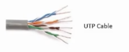
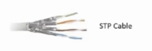
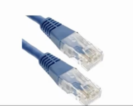
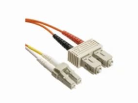
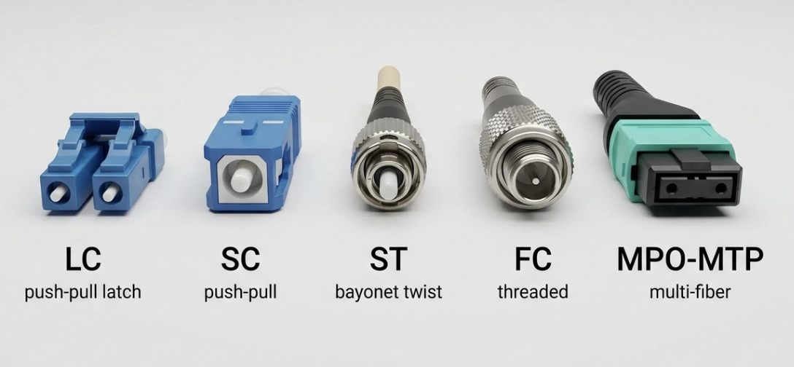
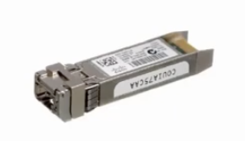

# 🔌 Layer 1 Technologies – Physical Media

The **Physical Layer (Layer 1)** of the OSI model is responsible for transmitting raw bits over a physical medium. It defines the electrical, mechanical, and physical specifications required to establish communication between network devices.

Common transmission media include:

- 🟤 Copper Cables (Ethernet)
- 💡 Fiber Optic Cables
- 📡 Wireless (Wi-Fi & Radio Frequency)

---

# 🟤 Copper Ethernet Cables

**Copper Ethernet cables** are the most widely used physical medium in Local Area Networks (LANs). They transmit data using **electrical signals** through twisted copper wires.

Over the years, Ethernet standards have evolved to support higher speeds while maintaining compatibility with existing networking equipment.

---

## Construction

A standard Ethernet cable contains:

- **8 copper wires**
- Organized into **4 twisted pairs**
- Uses an **RJ-45 connector**

```text
RJ-45 Connector
┌─────────────────┐
│ 1 2 3 4 5 6 7 8 │
└─────────────────┘

4 Twisted Pairs
Pair 1 → Pins 1 & 2
Pair 2 → Pins 3 & 6
Pair 3 → Pins 4 & 5
Pair 4 → Pins 7 & 8
```

---

## Ethernet Speeds

| Ethernet Standard | Speed | Copper Pairs Used |
|-------------------|--------|-------------------|
| Fast Ethernet (100BASE-TX) | 100 Mbps | 2 Pairs |
| Gigabit Ethernet (1000BASE-T) | 1 Gbps | 4 Pairs |
| 10 Gigabit Ethernet (10GBASE-T) | 10 Gbps | 4 Pairs |

---

# UTP (Unshielded Twisted Pair)

**UTP** is the most common Ethernet cable used in homes, offices, and enterprise LANs.
It contains twisted wire pairs without additional shielding.



### Advantages

- ✅ Low cost
- ✅ Lightweight
- ✅ Flexible and easy to install
- ✅ Suitable for most LAN environments

### Disadvantages

- ❌ More susceptible to electromagnetic interference (EMI)
- ❌ Less effective in electrically noisy environments

### Common Uses

- Home networks
- Office networks
- Schools
- Enterprise LANs

---

# STP (Shielded Twisted Pair)

**STP** cables include additional shielding around the twisted pairs to reduce electromagnetic interference (EMI) and crosstalk.
  
### Advantages

- ✅ Better protection against interference
- ✅ Improved signal quality
- ✅ Suitable for industrial environments

### Disadvantages

- ❌ More expensive
- ❌ Less flexible
- ❌ More difficult to install
- ❌ Requires proper grounding

### Common Uses

- Factories
- Data centers
- Hospitals
- High-interference environments

---

# RJ-45 Connector

The **RJ-45 (Registered Jack-45)** connector is the standard connector used for Ethernet cables.



### Characteristics

- 8 Pins
- Supports 4 twisted pairs
- Used with Cat5e, Cat6, Cat6a, and Cat7 cables
- Connects devices such as:
  - PCs
  - Switches
  - Routers
  - Access Points
  - Servers


---

# UTP vs STP

| Feature | UTP | STP |
|----------|-----|-----|
| Shielding | ❌ No | ✅ Yes |
| Cost | Lower | Higher |
| Flexibility | High | Lower |
| EMI Protection | Low | High |
| Installation | Easy | More Complex |
| Typical Use | Offices, Homes | Industrial & High-EMI Areas |

---

# 📌 Key Takeaways

- The **Physical Layer (Layer 1)** is responsible for transmitting **bits** over the physical medium.
- Ethernet copper cables use **4 twisted pairs (8 wires)**.
- **100 Mbps Ethernet** uses **2 pairs**.
- **1 Gbps and higher** Ethernet uses **all 4 pairs**.
- **UTP** is the most common Ethernet cable for LANs.
- **STP** provides better protection against electromagnetic interference.
- **RJ-45** is the standard connector used for Ethernet networking.

---

# 💡 Fiber Optic Cables

Fiber optic cables are a high-speed transmission medium that carries data using **light signals** instead of electrical signals. They provide higher bandwidth, faster speeds, and longer transmission distances than copper cables.

Unlike copper cables, which use multiple twisted wire pairs, a fiber optic cable uses **a single strand of glass or plastic fiber** to transmit light.

---

## How Fiber Optic Cables Work

Fiber optic communication uses either **LEDs** or **lasers** to generate light pulses. These light pulses travel through the fiber core using **Total Internal Reflection (TIR)** until they reach the receiving device.

The receiving device uses a **photodetector** to convert the light pulses back into electrical signals that computers, switches, and routers can process.

```text
Electrical Signal
        │
        ▼
 LED / Laser Transmitter
        │
        ▼
=========================
   Fiber Optic Cable
=========================
        │
        ▼
 Photodetector Receiver
        │
        ▼
Electrical Signal
```

---

## Advantages

- ✅ Very high bandwidth
- ✅ Supports long-distance communication
- ✅ Immune to electromagnetic interference (EMI)
- ✅ Low signal loss (attenuation)
- ✅ Lightweight and compact
- ✅ More secure than copper cables

---

## Disadvantages

- ❌ Higher cost
- ❌ More fragile than copper cables
- ❌ More difficult to install and repair
- ❌ Requires specialized equipment

---

## Transmission Speeds

Fiber optic cables support very high transmission speeds.

| Ethernet Standard | Speed |
|-------------------|-------|
| 1000BASE-X | 1 Gbps |
| 10GBASE | 10 Gbps |
| 40GBASE | 40 Gbps |
| 100GBASE | 100 Gbps |
| 400GBASE | 400 Gbps |

---

# Types of Fiber Optic Cables

## 🌈 Multimode Fiber (MMF)

Multimode Fiber uses **LEDs or VCSELs** as the light source.

It has a larger core that allows multiple light paths (modes) to travel simultaneously.

### Characteristics

- Light source: **LED / VCSEL**
- Core size: **50 µm or 62.5 µm**
- Suitable for **short distances**
- Lower cost than Single Mode Fiber

### Common Uses

- Enterprise LANs
- Office buildings
- Campus networks
- Data centers

---

## 🔴 Single Mode Fiber (SMF)

Single Mode Fiber uses a **laser** as the light source.

Its smaller core allows only one light path, reducing signal loss and enabling very long-distance communication.

### Characteristics

- Light source: **Laser**
- Core size: **9 µm**
- Suitable for **long distances**
- Higher bandwidth

### Common Uses

- Internet Service Providers (ISPs)
- Metropolitan Area Networks (MANs)
- Wide Area Networks (WANs)
- Long-distance backbone links

---

## Multimode vs Single Mode

| Feature | Multimode (MMF) | Single Mode (SMF) |
|----------|-----------------|-------------------|
| Light Source | LED / VCSEL | Laser |
| Core Size | 50/62.5 µm | 9 µm |
| Distance | Short | Long |
| Cost | Lower | Higher |
| Typical Use | LANs & Data Centers | WANs & ISP Networks |



---

# Common Fiber Connectors

Fiber optic cables use specialized connectors to connect networking equipment.

| Connector | Description |
|------------|-------------|
| LC | Small Form Factor connector commonly used in data centers |
| SC | Square connector commonly used in enterprise networks |
| FC | Threaded connector for high-vibration environments |
| ST | Twist-lock connector found in older installations |
| MTP/MPO | Multi-fiber connector for high-density and high-speed networking |
  


---

## Frequently Asked Questions

### Why do fiber optic cables use light instead of electricity?

Light can travel much longer distances with significantly lower signal loss and is not affected by electromagnetic interference (EMI), making fiber optics ideal for high-speed networking.

### How do devices understand light signals?

Network devices use **optical transceivers** (such as **SFP**, **SFP+**, **QSFP**, or **QSFP28** modules) to convert electrical signals into light for transmission and convert incoming light back into electrical signals for processing.



### Why is fiber speed limited?

The speed of light inside the fiber is extremely high. However, the maximum network speed depends on the capabilities of the network equipment, transceivers, and Ethernet standards (1 Gbps, 10 Gbps, 100 Gbps, etc.), rather than the fiber cable itself.

---

# 📌 Copper vs Fiber Optic

| Feature | Copper Ethernet | Fiber Optic |
|----------|-----------------|-------------|
| Transmission Medium | Electrical Signals | Light Signals |
| Speed | Up to 10 Gbps | 1 Gbps to 400+ Gbps |
| Distance | Up to 100 m | Several kilometers |
| EMI Resistance | Low | Excellent |
| Cost | Lower | Higher |
| Typical Use | LANs | Data Centers, WANs, ISP Networks |


---

# 🔗 Point-to-Point and Shared Media

Network communication can occur over different types of physical connections. The two most common communication models are **Point-to-Point (P2P)** and **Shared Media**.

---

## Point-to-Point (P2P)

A **Point-to-Point (P2P)** connection is a dedicated communication link between **exactly two devices**. No other devices share the transmission medium.

### Characteristics

- Direct connection between two devices
- Dedicated bandwidth
- No collisions caused by other devices
- Simple and reliable communication

### Example

```text
PC ───────────── Router
```

or

```text
Router ───────────── Router
```

### Advantages

- ✅ High performance
- ✅ Better security
- ✅ Low latency
- ✅ Reliable communication

---

## Shared Media

In a **Shared Media** network, multiple devices share the same communication medium. Communication is controlled by a **Layer 2 device**, such as a switch.

### Characteristics

- Multiple devices share the network
- Devices communicate through a switch
- Modern Ethernet switches reduce collisions by creating separate collision domains

### Example

```text
          Switch
        ┌────┼────┐
        │    │    │
      PC1   PC2  PC3
```

### Advantages

- ✅ Easy to expand
- ✅ Cost-effective
- ✅ Centralized management

---

# ⚡ Power over Ethernet (PoE)

**Power over Ethernet (PoE)** is a technology that allows an Ethernet cable to carry both **data** and **electrical power** to compatible devices.

This eliminates the need for a separate power adapter, reducing installation costs and simplifying cable management.

---

## Benefits of PoE

- ✅ One cable for both data and power
- ✅ Easier installation
- ✅ Lower infrastructure cost
- ✅ No separate AC power adapter required
- ✅ Flexible device placement

---

## PoE Components

### PSE (Power Sourcing Equipment)

A **Power Sourcing Equipment (PSE)** provides electrical power over the Ethernet cable.

Examples:

- PoE Switch
- PoE Injector

---

### PD (Powered Device)

A **Powered Device (PD)** receives power from the PSE.

Examples:

- Wireless Access Point (AP)
- IP Phone
- IP Camera
- VoIP Phone
- IoT Devices

---

## PoE Negotiation

Before power is supplied, the **PSE** and **PD** perform a negotiation process to determine:

- Whether the device supports PoE
- How much power is required
- The appropriate power level to deliver

This protects devices that do not support PoE.

---

## PoE Standards

| Standard | Maximum Power |
|----------|---------------:|
| IEEE 802.3af (PoE) | 15.4 W |
| IEEE 802.3at (PoE+) | 30 W |
| IEEE 802.3bt (PoE++) | Up to 90–95 W |

---

## Universal Power over Ethernet (UPoE)

**Universal Power over Ethernet (UPoE)** is Cisco's enhanced PoE technology.

Unlike standard PoE, which may use fewer wire pairs depending on the standard, **UPoE uses all four twisted pairs** of an Ethernet cable to deliver higher levels of power while simultaneously transmitting data.

This makes it suitable for devices with higher power requirements, such as:

- High-performance wireless access points
- Video conferencing systems
- Thin clients
- Digital displays

---

# 📌 Key Takeaways

- **Point-to-Point (P2P)** connects exactly two devices using a dedicated link.
- **Shared Media** allows multiple devices to communicate over the same network infrastructure.
- **PoE** delivers both data and electrical power through a single Ethernet cable.
- **PSE** supplies power, while **PD** receives it.
- Modern PoE standards can deliver **up to 90–95 W**, and **UPoE** uses all four twisted pairs for higher power delivery.


---

# ⚠️ Collisions

A **collision** occurs when two or more devices attempt to transmit data **at the same time** over a **shared communication medium**. When this happens, the transmitted frames interfere with each other, causing data corruption and requiring retransmission.

Collisions were common in older Ethernet networks that used **hubs** or operated in **Half-Duplex** mode. Modern switched Ethernet networks operating in **Full-Duplex** mode eliminate collisions.

---

## Collision Example

```text
        Hub
      ┌──┼──┐
      │  │  │
     PC1 PC2 PC3

PC1  ─────►
PC2  ─────►

Both devices transmit simultaneously
        ↓
     💥 Collision
```

---

# 🛡️ Carrier Sense Multiple Access with Collision Detection (CSMA/CD)

**CSMA/CD** is an Ethernet protocol designed to reduce collisions on shared media.

Before transmitting data, a device:

1. **Carrier Sense** – Listens to determine whether the medium is already in use.
2. **Multiple Access** – Multiple devices share the same transmission medium.
3. **Collision Detection** – If two devices transmit simultaneously, they detect the collision.
4. **Backoff Algorithm** – Each device waits for a random amount of time before attempting to retransmit.

> **Note:** CSMA/CD is only used in **Half-Duplex Ethernet**. It is **not used in Full-Duplex switched networks**.

---

# 🔄 Half-Duplex

In **Half-Duplex** communication, data can travel in **both directions**, but **only one direction at a time**.

If one device is transmitting, the other must wait until the transmission is complete.

### Characteristics

- One device transmits at a time
- Collisions can occur
- Uses CSMA/CD
- Lower performance than Full-Duplex

### Example

```text
PC ───────── Switch

Send ➜

OR

Receive ◀

(Not both at the same time)
```

---

# ⚡ Full-Duplex

In **Full-Duplex** communication, devices can **transmit and receive simultaneously**.

Since each device has separate transmit and receive paths, collisions do not occur.

### Characteristics

- Simultaneous transmission and reception
- No collisions
- Higher throughput
- Used in modern switched Ethernet networks

### Example

```text
PC ⇄ Switch

Send ➜
Receive ◀

Both happen simultaneously.
```

---

# ⚠️ Common Layer 1 Issues

Physical layer problems often prevent devices from establishing a network connection.

### Common Causes

- Damaged or disconnected cables
- Incorrect cable type
- Faulty RJ-45 connectors
- Unsupported or incompatible SFP transceivers
- Hardware failure
- Excessive cable length

---

# ⚠️ Duplex Mismatch

A **duplex mismatch** occurs when one device operates in **Half-Duplex** while the other operates in **Full-Duplex**.

### Symptoms

- Slow network performance
- Frame errors
- Dropped packets
- Late collisions

> **Best Practice:** Both devices should use the **same duplex setting** or negotiate it automatically.

---

# ⚠️ Speed Mismatch

A **speed mismatch** occurs when connected devices are configured for different Ethernet speeds.

Examples include:

- 10 Mbps
- 100 Mbps
- 1 Gbps
- 10 Gbps

If auto-negotiation fails or one side is manually configured, communication problems may occur.

> **Best Practice:** Configure both devices with matching speed settings or enable **Auto-Negotiation**.

---

# 📌 Key Takeaways

- A **collision** happens when two devices transmit at the same time on shared media.
- **CSMA/CD** detects collisions and schedules retransmissions.
- **Half-Duplex** supports communication in one direction at a time and may experience collisions.
- **Full-Duplex** allows simultaneous transmission and reception without collisions.
- Duplex and speed settings should match on both ends of a network connection.