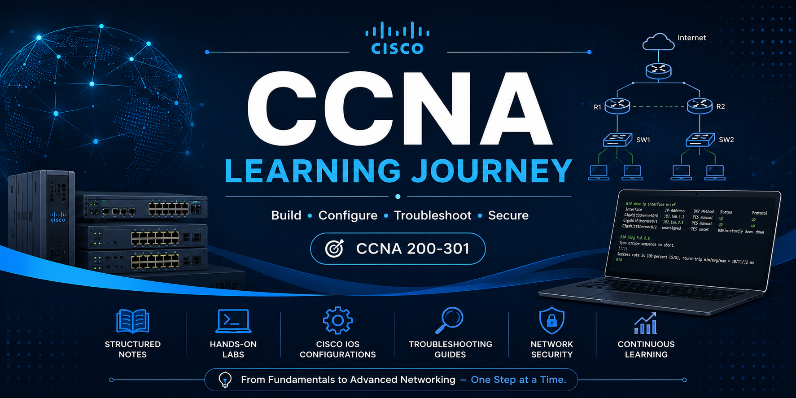

  

<h1 align="center">CCNA Learning Journey 🚀</h1>

Cisco Certified Network Associate (200-301)
 
Building a strong networking foundation for Cloud Engineering & Cloud Security.

---
## Goals
- Learn Networking Fundamentals
- Master Switching and Routing
- Practice with Packet Tracer
- Prepare for the Cisco CCNA (200-301)

## Progress

- [x] Network Fundamentals
- [ ] IPv4 Addressing
- [ ] Subnetting
- [ ] Ethernet
- [ ] VLANs
- [ ] STP
- [ ] EtherChannel
- [ ] Inter-VLAN Routing
- [ ] OSPF
- [ ] ACL
- [ ] NAT
- [ ] DHCP
- [ ] IPv6
- [ ] Security
- [ ] Automation

